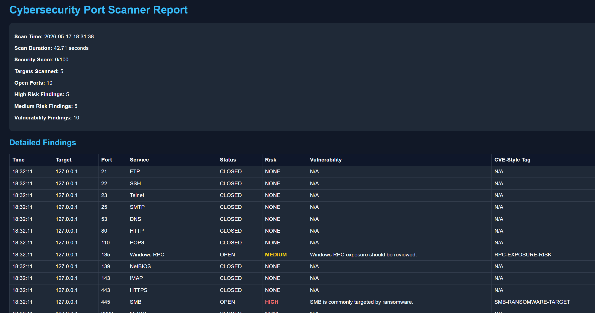

# Cybersecurity Port Scanner

A SOC-style Python cybersecurity tool designed to perform port scanning, risk analysis, vulnerability detection, reporting, and dashboard generation.

This project evolved from a basic socket-based scanner (V1) into a multi-feature cybersecurity assessment tool (V20) with HTML dashboards, JSON exports, CVE-style tagging, logging systems, and advanced reporting features.

---

# Features

## Core Scanning Features
- Single target scanning
- Local IP range scanning
- Multi-threaded scanning
- Banner grabbing
- Open/closed port detection
- Service identification
- Timestamped scan results

---

# Risk Analysis

The scanner classifies findings into:
- HIGH risk
- MEDIUM risk
- NONE

Example:
- SMB (445) → HIGH
- Windows RPC (135) → MEDIUM

---

# Vulnerability Detection

The scanner performs basic vulnerability-style analysis and generates:
- Warning messages
- Vulnerability alerts
- CVE-style tags

Examples:
- SMB-RANSOMWARE-TARGET
- RPC-EXPOSURE-RISK

---

# Exported Reports

The project automatically generates multiple report formats:

| File | Description |
|------|-------------|
| `scan_results.csv` | Full scan results |
| `open_ports.csv` | Open ports only |
| `scan_results.json` | JSON export |
| `report.txt` | Full security report |
| `vulnerabilities.txt` | Vulnerability findings |
| `logs/scan_history.txt` | Scan history logs |
| `reports/dashboard.html` | Interactive HTML dashboard |

---

# HTML Dashboard

The project generates a professional dark-themed HTML dashboard including:
- Security score
- Risk summaries
- Vulnerability findings
- Detailed scan table
- CVE-style tags

## Dashboard Preview



---

# Technologies Used

- Python 3
- Socket Programming
- Threading
- CSV
- JSON
- HTML/CSS
- File Handling
- Cybersecurity Concepts

---

# Project Evolution (V1 → V20)

## V1–V5
- Basic socket scanning
- Service detection
- Colored terminal output

## V6–V10
- IP range scanning
- Risk classification
- Warning system
- Vulnerability detection

## V11–V15
- JSON exports
- Security scoring
- CVE-style tags
- Scan history logging

## V16–V20
- HTML dashboard
- Advanced reports
- Open-port exports
- SOC-style workflow
- Dashboard visualization

---

# Installation

Clone the repository:

```bash
git clone https://github.com/fsetareh/cyber-port-scanner.git
```

Move into the project folder:

```bash
cd cyber-port-scanner
```

Install dependencies:

```bash
pip install -r requirements.txt
```

Run the scanner:

```bash
python scanner.py
```

---

# Example Scan Modes

## Single Target Scan

```text
1. Single target
```

Example:

```text
127.0.0.1
```

---

## Local IP Range Scan

```text
2. Local IP range
```

Example:

```text
Base IP: 127.0.0.
Start: 1
End: 5
```

---

# Example Output

```text
[OPEN] 127.0.0.1:445 | SMB | Risk: HIGH
[WARNING] SMB is commonly targeted by ransomware.
[CVE-LIKE] SMB-RANSOMWARE-TARGET
```

---

# Security Score

The scanner calculates a basic security score based on:
- Open ports
- Risk findings
- Vulnerability detections

---

# Future Improvements

Planned future versions may include:
- Real-time monitoring
- Flask web application
- Live charts
- SQLite database logging
- Email alert system
- CVE API integration
- Nmap integration
- Packet sniffing
- Threat intelligence feeds
- Authentication system

---

# Educational Purpose

This project was developed for cybersecurity learning, portfolio development, and SOC workflow simulation purposes only.

Use responsibly and only on systems you own or are authorized to test.

---

# Author

Fatemeh Setareh

GitHub:
https://github.com/fsetareh